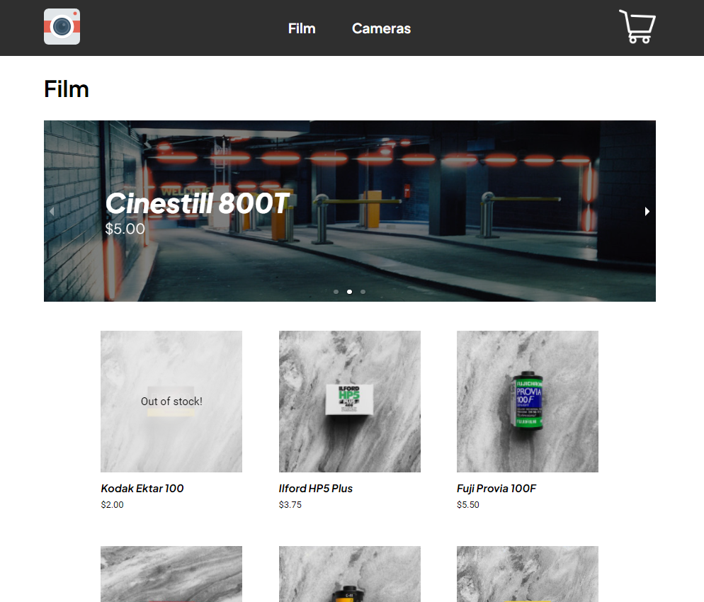
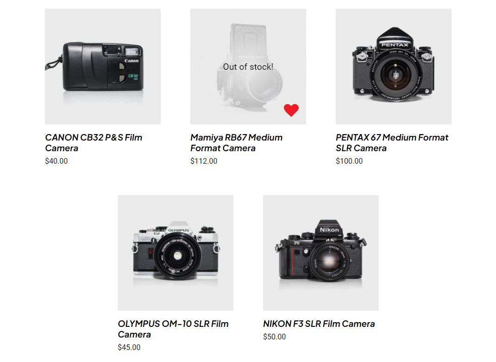
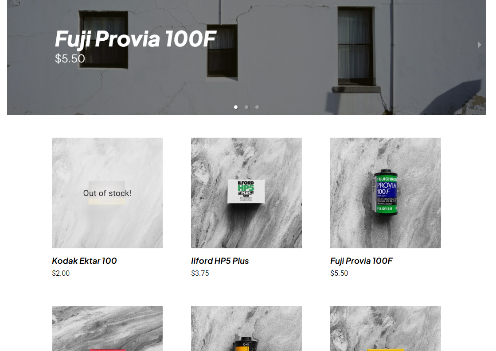

# E-Commerce Project in React

<br />

## **[Find this project hosted here](https://kchn.com.au/ecommerce-project)**

<br />



_Note that none of these product images are mine. A lot of the site's good looks
comes from beginningfilm.com and ikigaifilmlab.com.au/store_

This is a mock e-commerce website that uses create-react-app and firestore. The
products are stored as firestore documents and user interactions requiring
persistence like a favourites product list or adding products to their cart use
localStorage.

## Contents

-   ## [Project Brief](#project-brief-1)

-   ## [Technical Implementation](#technical-implementation-1)

-   ## [Notes on Design](#notes-on-design-1)

-   ## [Project Reflection](#project-reflection-1)

-   ## [TL:DR](#tldr-1)

## Project Brief

### Aims

The aims of this project are to reinforce the React learning that I have been
doing. Hopefully at the end of this project I will be a much more experience
developer. Things that will be new to me in this project are:

-   Data fetching with React
-   Using react-router-dom
-   Using Firebase and Firestore

### Minimum Viable Product:

2 pages:

-   Home Page
-   Grid of products
-   Carousel of featured products
-   Product Page (with id parameter) Similar to a product page on another site,
    allows you to add to cart and select product variants

All products should be stored in Firestore, you should store the following
information:

-   quantity
-   variants (could be colors, sizes, etc)
-   price per unit
-   name
-   image url
-   favourited or not (boolean)

All data should be stored in Firestore and fetched by the frontend, there should
be NO static product data in the react application

### Bonus:

Using Firestore and react create, a cart system. Create a cart page in your
react app Add logic to prevent users from adding items to cart that are no
longer in stock. You will have to check the current cart and the product
quantity Cart page should have the following:

-   List of products in cart
-   ability to change quantity of products in cart
-   ability to remove items from cart

Make sure your site is scoped to one category of products

## Technical Implementation

### File structure

```
📦src
 ┣ 📂components
 ┃ ┣ 📂Card
 ┃ ┃ ┣ 📜Card.jsx
 ┣ 📂hooks
 ┣ 📂routes
 ┃ ┣ 📂Cart
 ┃ ┃ ┣ 📂CartItem
 ┃ ┃ ┃ ┣ 📜CartItem.jsx
 ┃ ┃ ┣ 📜Cart.jsx
 ┃ ┣ 📂ProductPage
 ┃ ┃ ┣ 📂Description
 ┃ ┃ ┣ 📂VariantButton
 ┃ ┃ ┣ 📂VariantButtons
 ┃ ┃ ┣ 📜ProductPage.jsx
 ┣ 📜App.jsx
```

This was the biggest React project that I have worked on so far. Above is an
example of the file structure that I ended up using. The `components` folder was
strictly for components that would be used in more than one context. The
`routes` folder contained whole pages and often many page-specific
sub-components. I think this was an okay way to structure my project. Being
inexperienced with projects this size, I'm sure there are many better ways to do
things.

### Using local storage

Even though the project requirements mentions using the firestore database to
store favourited products, I opted to use `localStorage` instead. There were a
few reasons that I broke the brief in this regard:

-   I wanted more experience working with the local storage interface.

-   I wanted interaction like changing cart quantities to be more responsive. I
    didn't want the app to have to wait for the server for so many interactions.

Integration the local storage interaction into already cumbersome components was
a little too cumbersome for me. Which leads me to the next topic:

### Using custom hooks

I found using custom hooks was a really good way of abstracting logic and
cleaning up repetitive boilerplate code from components. With a project of this
complexity, I was looking for ways to keep components organised.

Although many of the hooks had `use` in the front of their name, they were more
similar to service functions. They hid away the tedious tasks associated with
dealing with the `localStorage` API for example. They did however, additionally
manage any related state that the component will need to use, which in my
opinion qualifies them to be react hooks.

## Notes on Design

While I'm not totally satisfied with the end-result, there were a few tricks
that I think improved the look of the website.



_Decreasing the brightness of thumbnails with white backgrounds using the
`filter: brightness()` property is an easy way of improving the look of your
project_

### Using the CSS `filter` property on product thumbnails.

Using product thumbnails with a white background on a page with a white
background is not my kind of aesthetic. Seeing the edges of the images
reinforces the grid and is much more pleasing to the eye. Using
`filter: brightness()` we can reduce the maximum white point of the image. This
works particularly well on images with a white background as you get a uniform
off-white, which is a popular background on many online stores.

In the general sense, having the product thumbnails be uniform in their
background and styling is the best -- albeit high effort -- way to improve the
look of your ecommerce store.



_Who needs those perfectly sized grids anyway?_

### Embracing imperfect grids

Given my design style, I was previously obsessed with making sure the left and
right edges of every element on the page line up. However, with a grid of
elements, this introduces an interesting conundrum. Resizing the page would
either stretch the aspect ratio of the elements in your grid (no doubt creating
some image scaling weirdness), or create large gaps between each column.

For this project I decided to let my worries go and have a fixed gap between
each column. While the grid never quite touches the edges of the container, it
looks much better than any solution that I've tried before.

## Project Reflection

### Challenges

#### Complexity

The hardest part of this project for me was managing complexity. With each route
(such as the Product Page) being so complex on their own, I wasn't having the
best time trying to manage the complexity of some of the components. I think in
the future, I will be way more willing to create sub components when I
anticipate that things will get too complicated, instead of waiting until they
get too much and then having to refactor afterwards.

#### Readability

I find JSX hard to read, especially with big components. Halfway through the
project, I realised how much time I was spending scrolling through my
components, so I went through and added comments to split up the JSX by section.

When it comes to the rest of the functional component, I did the same, splitting
the function into sections delineated by the purpose of the code (e.g. one
section would be an `isFavourited` state and the relevant event handlers). In
the future I will also split up the useEffects into all the different sections
as well (I know thats kind of the whole point of react hooks but I forgot).

#### SCSS

The styling ended up being a disaster. While I did use SCSS modules, I neglected
to create a variables or mixins file, which I will definitely do in the future
if I end up using sass in another React project. Another way that I would
address this is using Styled Components, which I learnt for a subsequent
project. Styled Components have a theme provider that allows you to styles like
colours.

#### Custom Hooks

One criticism that I received for my implementation of custom hooks was that it
potentially made the code less explicit. Without having the logic present in the
function, you need very well-named variables to communicate to another
programmer what the hook does.

### Future Direction

If I were to work on this project any further I would:

-   Clean up SCSS.

-   Fix some strange input behaviour with the order quantities.

-   Add a feature that would allow an administrator to replenish stock and
    add/remove products.

## TL:DR

### What happened

-   React can get really hard for big projects.

-   JSX got really messy but I fixed it mostly with commenting and some sub
    components.

-   SCSS got really messy but it was so messy I didn't bother to fix it.

-   Created some custom hooks. Mostly to use localStorage.

### In the future I will:

-   Use Styled Components to make my styling simpler and DRYer.

-   Make sub components BEFORE things get messy.

-   Make sure that my custom hooks are well-named or thoroughly documented so
    other developers know what is going on.
